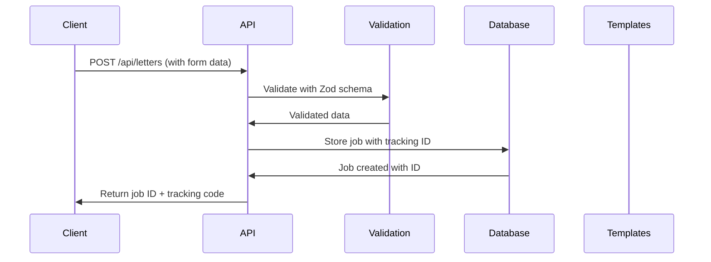

# Mail My Forms - Technical Documentation

## Overview
Mail My Forms is a full-stack web application that allows users to compose, preview, and submit physical letters for printing and mailing. The system handles template selection, address validation, message composition, and provides tracking capabilities for submitted letters.

## Architecture

### Technology Stack
- **Frontend**: React 18 + TypeScript + Vite
- **Backend**: Node.js + Express + TypeScript
- **Database**: PostgreSQL with Prisma ORM
- **Containerization**: Docker + Docker Compose
- **Templating**: Handlebars for letter generation
- **Validation**: Zod for API schema validation

### Container Architecture
```
┌─────────────────┐    ┌─────────────────┐    ┌─────────────────┐
│   Web (React)   │    │  Server (API)   │    │  Database (PG)  │
│   Port: 3001    │────│   Port: 4000    │────│   Port: 5432    │
│                 │    │                 │    │                 │
└─────────────────┘    └─────────────────┘    └─────────────────┘
```

## Database Schema

### Job Table (Primary Entity)
```sql
model Job {
  id          String   @id @default(cuid())
  createdAt   DateTime @default(now())
  templateId  String?
  body        String   @default("")
  sender      Json
  recipient   Json
  serviceLevel String  @default("first_class")
  options     String[]
}
```

### JSON Structure for Addresses
```typescript
interface Address {
  name: string;
  address_line1: string;
  address_line2?: string;
  address_city: string;
  address_state: string;
  address_zip: string;
  address_country: string;
}
```

## Backend API Architecture

### Core Files Structure
```
server/
├── src/
│   ├── index.ts          # Main Express server & API routes
│   ├── db.ts            # Database connection & initialization
│   ├── address.ts       # Address validation utilities
│   ├── pdf.ts           # PDF generation (planned)
│   ├── store.ts         # File-based storage fallback
│   ├── worker.ts        # Background job processing
│   └── providers/
│       └── lob.ts       # Lob.com integration (planned)
├── templates/           # Handlebars letter templates
├── prisma/
│   └── schema.prisma    # Database schema
└── dist/               # Compiled TypeScript
```

### API Endpoints

#### Core Letter API
- **POST /api/letters** - Submit new letter for processing
- **GET /api/jobs** - List all submitted jobs
- **GET /api/health** - Health check endpoint
- **GET /api/config** - Get system configuration

#### Template System
- **GET /api/templates/:templateId/preview** - Generate template preview with sample data

#### Built-in UI (Legacy)
- **GET /ui** - Built-in form interface (serves HTML directly from server)

### Request/Response Flow

#### Letter Submission Flow


### Data Validation Pipeline

#### Zod Schema Validation
```typescript
const LetterSchema = z.object({
  templateId: z.string().nullable().optional(),
  customBody: z.string().nullable().optional(),
  body: z.string().nullable().optional(),
  subject: z.string().nullable().optional(),
  fields: z.record(z.string()).optional(),
  sender: z.object({ 
    name: z.string(),
    address_line1: z.string(),
    address_line2: z.string().optional(),
    address_city: z.string(),
    address_state: z.string(),
    address_zip: z.string(),
    address_country: z.string()
  }),
  recipient: z.object({ 
    // Same structure as sender
  }),
  serviceLevel: z.string().optional(),
  options: z.array(z.string()).optional(),
});
```

#### Address Validation
```typescript
// From address.ts
function validateAddressFields(address: any): ValidationResult {
  const required = ['address_line1', 'address_city', 'address_state', 'address_zip', 'address_country'];
  // Validates presence of required fields
  // Normalizes country codes to Alpha-2 format
}
```

### Template System

#### Available Templates
1. **tpl-default** - Standard business letter
2. **tpl-formal** - Legal/official correspondence
3. **tpl-personal** - Personal letters with warm styling
4. **tpl-invoice** - Professional invoice/billing format

#### Template Preview System
Templates are rendered server-side using Handlebars with sample data:
```typescript
// Template preview endpoint generates HTML with sample data
app.get('/api/templates/:templateId/preview', async (req, res) => {
  const template = Handlebars.compile(templateSource);
  const html = template(sampleData);
  
  // Set headers to allow iframe embedding
  res.setHeader('X-Frame-Options', 'SAMEORIGIN');
  res.setHeader('Content-Security-Policy', 'frame-ancestors \'self\' http://localhost:3001');
  
  res.send(html);
});
```

### Storage Strategy

#### Database-First with Fallback
```typescript
// From db.ts
export async function init() {
  try {
    const prisma = new PrismaClient();
    await prisma.$connect();
    return { prisma, connected: true };
  } catch (error) {
    console.warn('Database unavailable, using file storage');
    return { prisma: null, connected: false };
  }
}
```

#### File Storage Fallback
When database is unavailable, jobs are stored in `server/data/jobs.json` with the same structure.

### Job Processing & Tracking

#### Job Lifecycle
1. **Submitted** - Initial state when job is created
2. **Processing** - Job picked up by worker (planned)
3. **Printed** - Letter generated and sent to print service (planned)
4. **Mailed** - Letter handed to postal service (planned)
5. **Delivered** - Final state when letter reaches recipient (planned)

#### Tracking System
Each job gets a unique tracking code: `T{JOB_ID_UPPERCASE}`
```typescript
const job = {
  id: nanoid(12),
  tracking: { 
    provider: 'mock', 
    code: 'T' + id.toUpperCase(), 
    events: [{ at: now, status: 'submitted' }] 
  }
};
```

## Frontend Architecture (React App)

### Component Structure
```
web/src/
├── App.tsx              # Main application component
├── main.tsx            # React entry point
└── (single-component architecture)
```

### State Management
The application uses React's built-in useState for state management:

```typescript
// Address state (sender & recipient)
const [senderName, setSenderName] = React.useState('');
const [senderLine1, setSenderLine1] = React.useState('');
// ... (12 total address fields)

// Template & content state
const [templateId, setTemplateId] = React.useState('tpl-default');
const [messageContent, setMessageContent] = React.useState('');
const [subject, setSubject] = React.useState('');

// UI state
const [showPreview, setShowPreview] = React.useState(false);
const [isSubmitting, setIsSubmitting] = React.useState(false);
const [result, setResult] = React.useState('');
```

### UI Layout System

#### Responsive Grid Layout
```css
/* Main form layout */
display: grid;
gridTemplateColumns: '1fr 1fr';  /* Equal width sections */
gap: '25px';

/* Address field layout */
gridTemplateColumns: '2fr 1fr';     /* Address line 1 + 2 */
gridTemplateColumns: '2fr 1fr 1fr 1fr'; /* City + State + ZIP + Country */
```

#### Template Preview Modal System
```typescript
function openPreview(template: string) {
  setPreviewTemplate(template);
  setShowPreview(true);
}

// Modal renders iframe pointing to server preview endpoint
<iframe src={`http://localhost:4000/api/templates/${previewTemplate}/preview`} />
```

### Form Submission Flow

#### Data Preparation
```typescript
const submit = async (e: React.FormEvent) => {
  // Prepare structured address objects
  const sender = {
    name: senderName,
    address_line1: senderLine1,
    address_line2: senderLine2,
    address_city: senderCity,
    address_state: senderState,
    address_zip: senderZip,
    address_country: senderCountry
  };
  
  // Convert line breaks to HTML
  const bodyContent = messageContent.replace(/\n/g, '<br />');
  
  // Submit to API
  const res = await fetch('http://localhost:4000/api/letters', {
    method: 'POST',
    headers: { 'Content-Type': 'application/json' },
    body: JSON.stringify({ 
      sender, 
      recipient, 
      templateId,
      serviceLevel: 'first_class',
      body: bodyContent,
      subject: subject || undefined
    })
  });
};
```

## Development Environment

### Docker Compose Configuration
```yaml
version: '3.8'
services:
  db:
    image: postgres:15
    environment:
      POSTGRES_USER: postgres
      POSTGRES_PASSWORD: postgres
      POSTGRES_DB: mailmyforms
    ports:
      - "5432:5432"

  server:
    build: .
    depends_on:
      - db
    environment:
      DATABASE_URL: postgres://postgres:postgres@db:5432/mailmyforms
      PORT: 4000
    ports:
      - "4000:4000"

  web:
    build: ./web
    ports:
      - "3001:3001"
    depends_on:
      - server
```

### Build Process

#### Server Build (TypeScript Compilation)
```dockerfile
FROM node:20-alpine AS builder
WORKDIR /app
COPY . .
RUN npm install --production=false --silent
WORKDIR /app/server
RUN npm run build  # Compiles TypeScript to /dist

FROM node:20-alpine
WORKDIR /app
COPY --from=builder /app/server/dist ./server/dist
COPY --from=builder /app/server/package.json ./server/package.json
CMD ["node", "server/dist/index.js"]
```

#### Web Build (Vite Development Server)
```dockerfile
FROM node:20-alpine
WORKDIR /app
COPY package*.json ./
RUN npm install
COPY . .
CMD ["npm", "run", "dev", "--", "--host", "0.0.0.0"]
```

### Environment Variables
```bash
# Server
DATABASE_URL=postgres://postgres:postgres@db:5432/mailmyforms
PORT=4000

# Database
POSTGRES_USER=postgres
POSTGRES_PASSWORD=postgres
POSTGRES_DB=mailmyforms
```

## Security Considerations

### Content Security Policy
Template previews are served with specific CSP headers to allow iframe embedding:
```typescript
res.setHeader('X-Frame-Options', 'SAMEORIGIN');
res.setHeader('Content-Security-Policy', 'frame-ancestors \'self\' http://localhost:3001');
```

### Input Validation
- All API inputs validated with Zod schemas
- Address fields validated for required components
- Country codes normalized to ISO Alpha-2 format
- Message content sanitized for HTML rendering

### CORS Configuration
Currently configured for development (localhost:3001 ↔ localhost:4000). Production deployment would need environment-specific CORS settings.

## Data Flow & Integration Points

### Letter Processing Pipeline
```
User Input → React Form → API Validation → Database Storage → 
Template Rendering → PDF Generation (planned) → Print Service (planned) → 
Postal Service (planned) → Delivery Tracking (planned)
```

### External Service Integration Points
- **Lob.com** - For actual letter printing and mailing (infrastructure present)
- **PDF Generation** - Server-side template to PDF conversion (infrastructure present)
- **Address Validation** - Could integrate with postal service APIs
- **Payment Processing** - Currently shows $2.50 pricing (not implemented)

## Deployment Considerations

### Production Readiness Checklist
- [ ] Environment-specific configuration management
- [ ] HTTPS/TLS certificate configuration
- [ ] Production database with connection pooling
- [ ] Error logging and monitoring
- [ ] Rate limiting and abuse prevention
- [ ] Payment processing integration
- [ ] Email notifications for job status
- [ ] Backup and disaster recovery procedures

### Scaling Considerations
- Database optimization for high job volume
- Background job queue for letter processing
- CDN for static assets and template previews
- Load balancing for multiple server instances
- File storage for generated PDFs and templates

## Troubleshooting Guide

### Common Issues
1. **Docker Build Failures**: Ensure Docker Desktop is running and ports 3001, 4000, 5432 are available
2. **Database Connection**: Check DATABASE_URL format and PostgreSQL container status
3. **Template Previews Not Loading**: Verify CSP headers and iframe permissions
4. **TypeScript Compilation**: Run `npm run build` in server directory to check for errors
5. **CORS Issues**: Ensure frontend and backend URLs match environment configuration

### Development Commands
```bash
# Start entire stack
docker compose up --build

# Rebuild specific service
docker compose build --no-cache web
docker compose up -d web

# Check logs
docker compose logs server
docker compose logs web
docker compose logs db

# Database management
docker compose exec db psql -U postgres -d mailmyforms

# Server shell access
docker compose exec server sh
```

## Future Enhancement Roadmap

### Immediate Improvements
- Complete Lob.com integration for actual letter mailing
- PDF generation from Handlebars templates
- Email notifications for job status updates
- Payment processing integration

### Advanced Features
- User accounts and authentication
- Letter templates customization interface
- Bulk letter sending capabilities
- Advanced address validation with postal APIs
- Letter scheduling and recurring mailings
- Analytics dashboard for usage metrics

This documentation provides a complete technical overview for any developer taking over or contributing to the Mail My Forms project. The architecture is designed for scalability and the codebase follows modern development practices with comprehensive error handling and fallback mechanisms.
